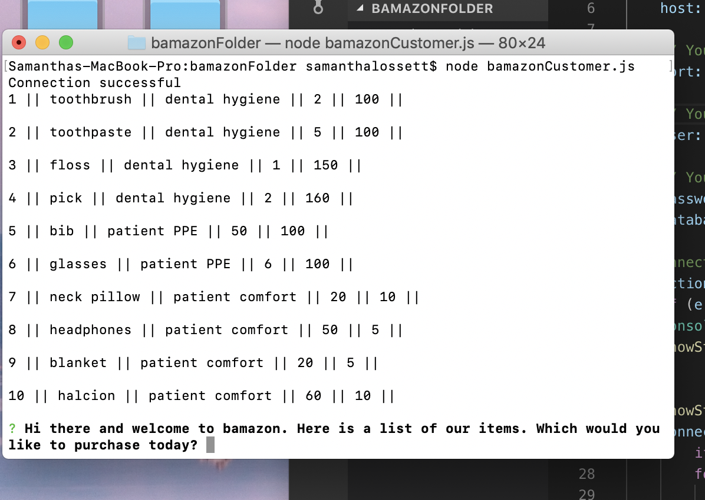
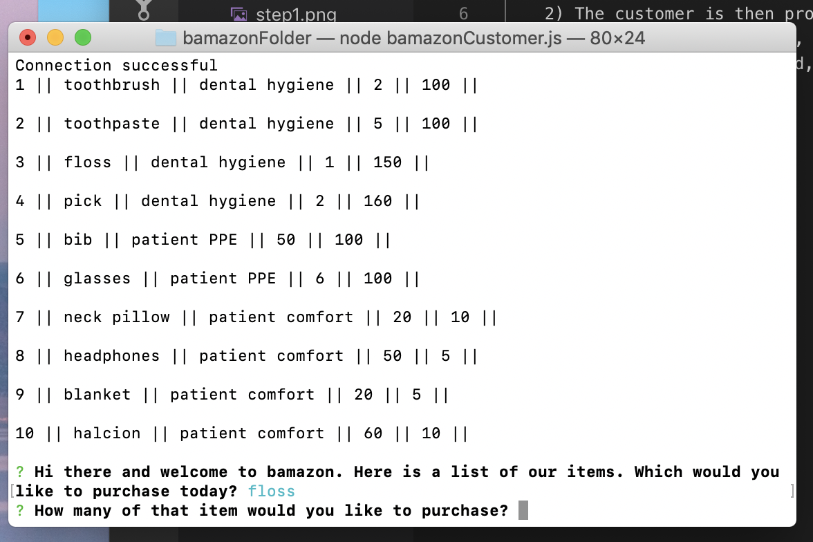
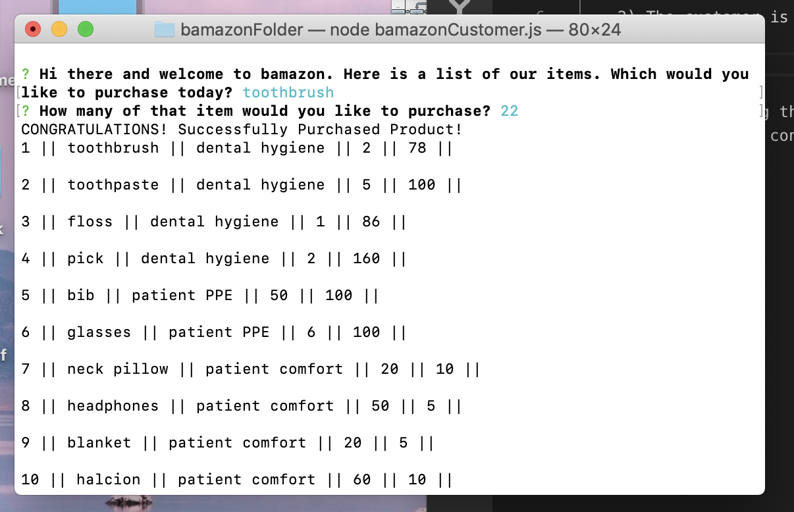

This application uses Node and SQL to display an online store named bamazon and allow the customer to purchase items.

Instructions:
    1) Direct terminal to the bamazon folder. Then, type "node bamazonCustomer.js" and the products will pop up.

    2) The customer is then prompted to type in which item they would like to purchase.

    3) After stating the item, the customer receives another prompt asking how many of the item they want to purchase.
    4) Once this is completed, the quantity of that item is adjusted accordingly and displayed as such.

